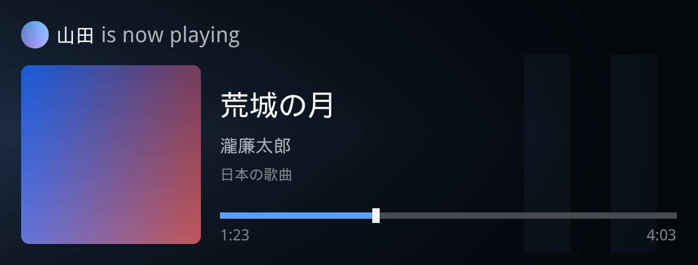

# tg-spotifystatusbot

Inline Telegram bot that OAuth-links each user's Spotify account and **always freshly renders** a now-playing card (album art, title, artist, progress bar). Nothing is cached: every `/now` and every inline query hits Spotify and draws a new image.



The example image above is produced by the renderer crate via `just render-example` (`cargo xtask render-example`).

## What it does

- `/start`, `/help`, `/privacy` — onboarding and data policy
- `/link` — Spotify OAuth (PKCE) with a button; tokens stored in **redb**
- `/unlink` — delete stored tokens
- `/now` — upload a freshly rendered JPEG to the chat
- Admins: `/allow`, `/deny`, `/allowlist` (admins come from `ADMIN_USER_IDS` only)
- Inline (`@your_bot` in any chat) — query text is ignored; you always get **your** current track
- Empty / not-linked / error states render dedicated cards
- Inline results use `cache_time = 0` and `is_personal = true`
- Card URLs are HMAC-signed and short-lived; Telegram fetching them still renders live (`Cache-Control: no-store`)

## Workspace

| Crate | Role |
| --- | --- |
| `crates/tg-spotifystatusbot` | Frankenstein bot, OAuth HTTP server, redb, Spotify client |
| `crates/tg-spotifystatusbot-render` | Now-playing card renderer (used by the bot **and** xtask) |
| `xtask` | `cargo xtask render-example` writes `assets/example-status.png` |

IDs that we generate (OAuth `state`, inline result ids, temp filenames) are **UUIDv7**.

## Prerequisites

1. Create a bot with [@BotFather](https://t.me/BotFather).
2. Enable **inline mode** (`/setinline`).
3. Create a [Spotify app](https://developer.spotify.com/dashboard).
4. Set the Spotify redirect URI to exactly:

   `https://<your-public-host>/oauth/callback`

   That host must be reachable by both Spotify (OAuth redirect) and Telegram (inline photo URL). HTTPS is required in production.

## Configuration

Copy `.env.example` to `.env` and fill it in:

| Variable | Required | Description |
| --- | --- | --- |
| `TELEGRAM_BOT_TOKEN` | yes | BotFather token |
| `SPOTIFY_CLIENT_ID` | yes | Spotify application client id |
| `SPOTIFY_CLIENT_SECRET` | yes | Spotify application client secret |
| `PUBLIC_BASE_URL` | yes | Public origin, e.g. `https://bot.example.com` |
| `OAUTH_REDIRECT_URI` | no | Defaults to `$PUBLIC_BASE_URL/oauth/callback` |
| `REDB_PATH` | no | Defaults to `./data/bot.redb` |
| `HTTP_BIND` | no | Defaults to `0.0.0.0:8080` |
| `CARD_SIGNING_SECRET` | no | HMAC secret for card URLs; defaults to a derivation of the bot token |
| `ADMIN_USER_IDS` | no | Comma/space-separated Telegram user ids that can manage the allowlist |
| `RUST_LOG` | no | Defaults to `info` |

Access: **admins** (from env) and **allowlisted** users. Admins add/remove people with `/allow <id>` and `/deny <id>` (or reply to a user). The allowlist is stored in redb; the admin list is env-only and never written to the database.

The process also stores Telegram user id ↔ Spotify tokens (and short-lived OAuth state). It does **not** store now-playing payloads or rendered images.

## just recipes

```bash
just build            # workspace debug build
just release          # release bot binary
just test             # cargo test --workspace
just run              # cargo run -p tg-spotifystatusbot
just render-example   # write assets/example-status.png
just clippy
just fmt
just docker           # docker compose build
just docker-up
just docker-down
```

Run locally after exporting the env vars (or using a process supervisor that loads `.env`):

```bash
just run
```

HTTP endpoints:

- `GET /healthz`
- `GET /oauth/callback`
- `GET /card/{telegram_user_id}.jpg?t=<unix>&sig=<hmac>`

## Docker Compose

```bash
cp .env.example .env
# edit .env
just docker-up
```

The compose file publishes `${HTTP_PUBLISH_PORT:-8080}:8080` and keeps redb on a named volume. Put a reverse proxy (Caddy/nginx) in front so `PUBLIC_BASE_URL` is HTTPS.

## systemd

A hardened unit lives at [`deploy/tg-spotifystatusbot.service`](deploy/tg-spotifystatusbot.service).

```bash
sudo useradd --system --home /var/lib/tg-spotifystatusbot --create-home tg-spotifystatusbot
sudo install -m 0755 target/release/tg-spotifystatusbot /usr/local/bin/tg-spotifystatusbot
sudo install -m 0640 .env /etc/tg-spotifystatusbot.env
sudo install -m 0644 deploy/tg-spotifystatusbot.service /etc/systemd/system/
sudo systemctl daemon-reload
sudo systemctl enable --now tg-spotifystatusbot
```

Set `REDB_PATH=/var/lib/tg-spotifystatusbot/bot.redb` in the env file.

## Tests

```bash
just test
```

Coverage includes redb save/load/delete/refresh-token updates, OAuth state expiry, Spotify JSON mapping, card URL signatures, and playing/idle/error card renders.

## Manual checklist

1. `/start` then `/link` — complete Spotify consent.
2. Play a track. `/now` should send a new card.
3. Mention the bot inline (any query text). The image should match the live progress, not a previous result.
4. `/unlink` — tokens gone; inline/`/now` show the not-linked card.

There are no GitHub Actions workflows in this repo.

## Fonts

Cards use a stacked fallback so Latin, Cyrillic, and CJK can render:

| File | Family | Scripts | License |
| --- | --- | --- | --- |
| `crates/tg-spotifystatusbot-render/assets/fonts/DroidSans.ttf` | [Droid Sans](https://www.droidfonts.com/) Regular | Latin | [Apache License 2.0](https://www.apache.org/licenses/LICENSE-2.0) |
| `crates/tg-spotifystatusbot-render/assets/fonts/DroidSans-Bold.ttf` | [Droid Sans](https://www.droidfonts.com/) Bold | Latin | [Apache License 2.0](https://www.apache.org/licenses/LICENSE-2.0) |
| `crates/tg-spotifystatusbot-render/assets/fonts/DroidSansFallbackFull.ttf` | [Droid Sans Fallback](https://www.droidfonts.com/) | CJK and other fallback glyphs | [Apache License 2.0](https://www.apache.org/licenses/LICENSE-2.0) |
| `crates/tg-spotifystatusbot-render/assets/fonts/NotoSans.ttf` | [Noto Sans](https://fonts.google.com/noto/specimen/Noto+Sans) | Latin, Cyrillic, Greek | [SIL Open Font License 1.1](https://scripts.sil.org/OFL) |

Droid fonts are from the Android Open Source Project / Google. Noto Sans is from [Google Fonts / Noto](https://github.com/notofonts/latin-greek-cyrillic). The example card uses **荒城の月** to exercise CJK fallback.
